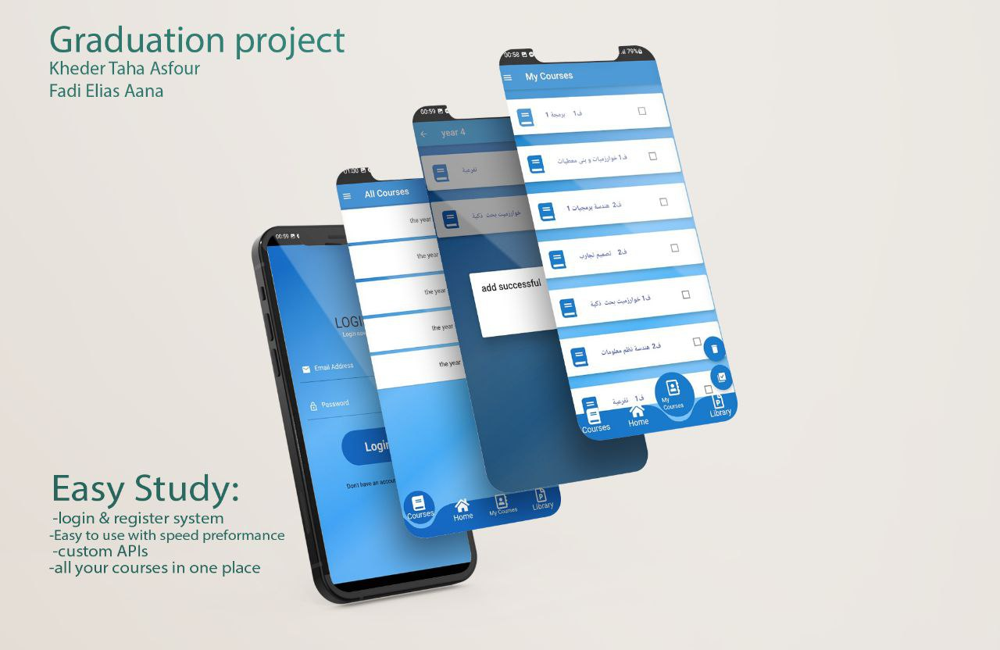
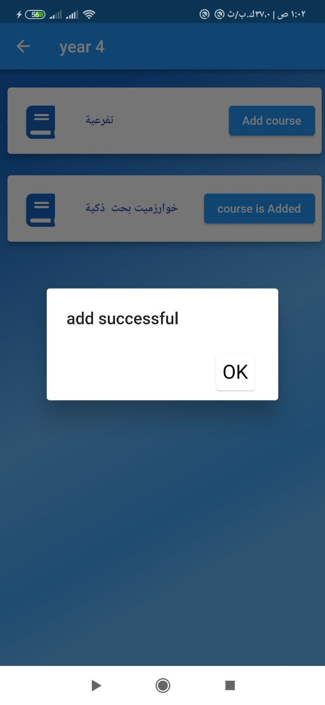
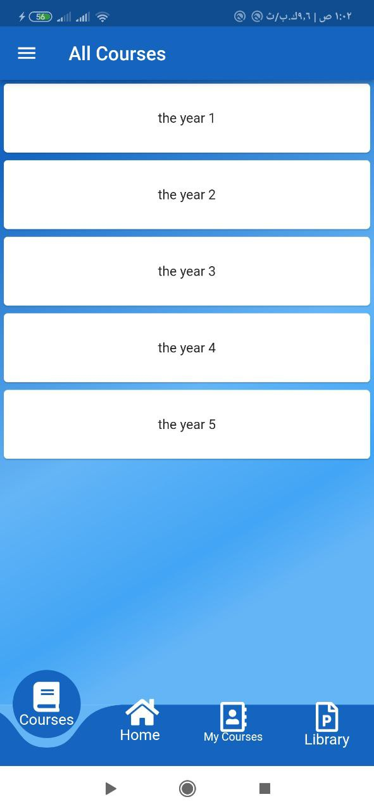
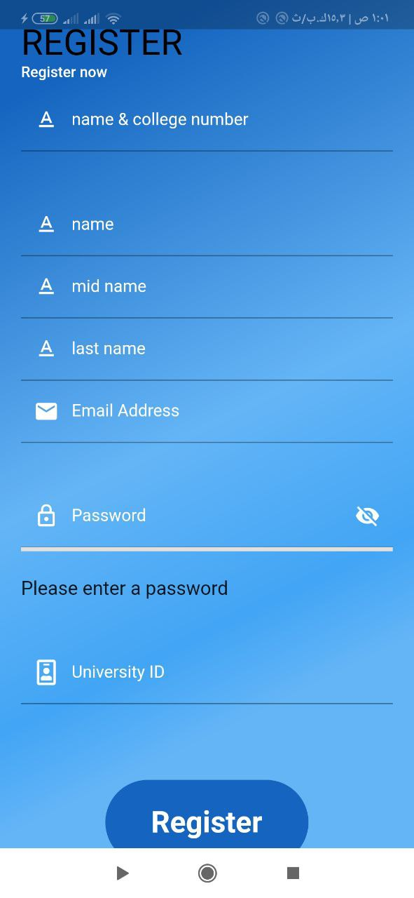
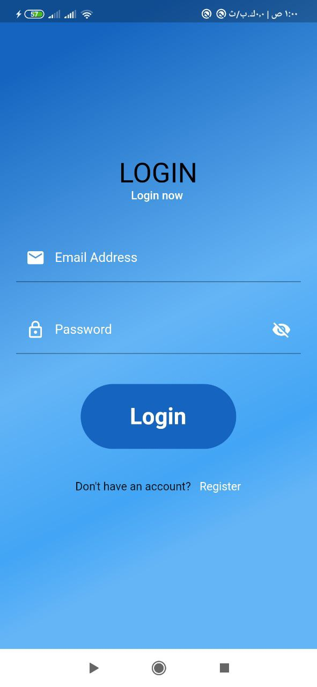
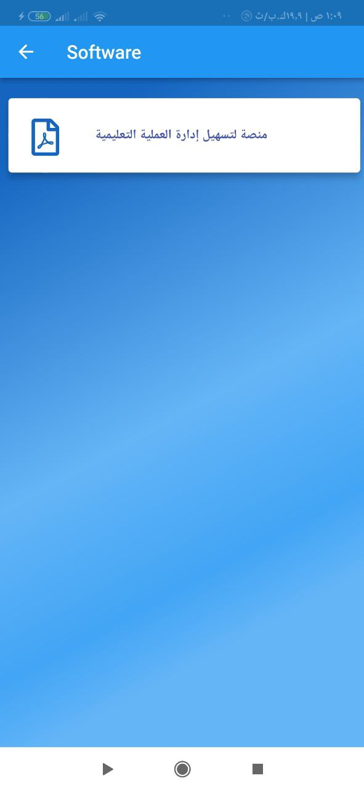
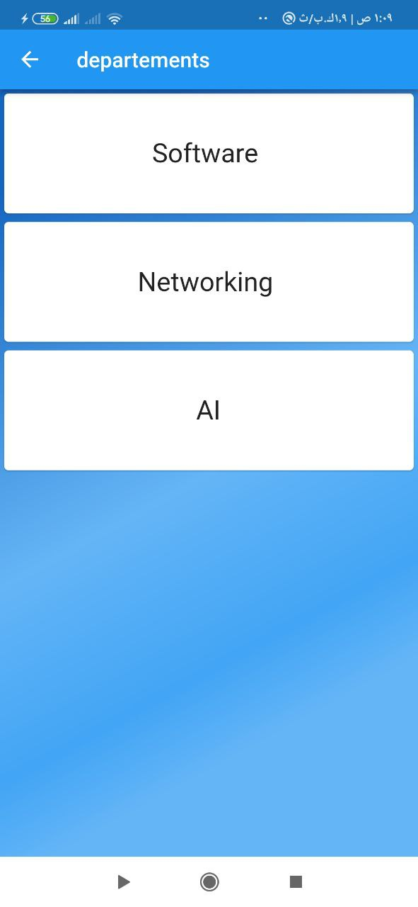
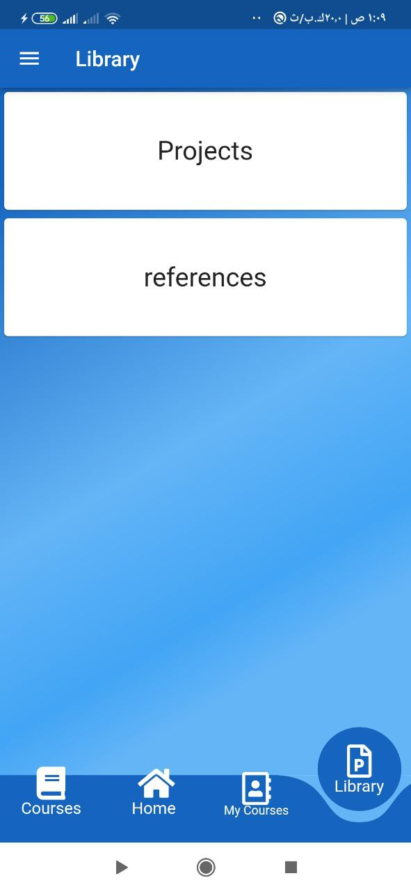

# easy_study
mobile app that helps student in my college to get their courses and lectures while they are at home.
#

## About
- Easy_study using `cubit bloc` state management flutter and `MVVM` architecture.
and using `node js` server.

- - - -
## Services provided by the application
* Register & Login.
* Show all courses.
* Show all lecture in course and download pdf .
* Add any course to my courses.
* Edit My courses collection (delete & insert).
* Show Library contents (Projects & References).
* Show advertisement and download file 
* Show my profile and edite.

## ScreenShot

